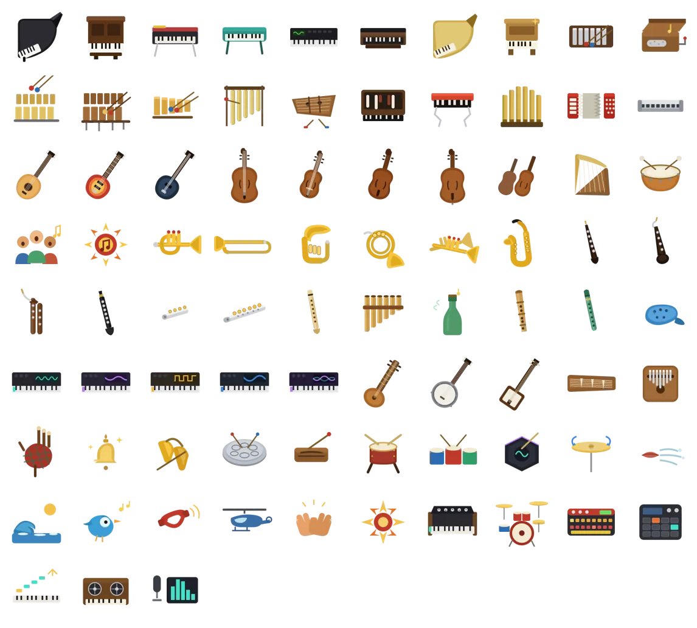

# Music Instruments for Stage Keys

> A Stream Deck icon pack for the live keyboardist (short name: **Stage Keys**).

**▶ [Get it free on the Elgato Marketplace](https://marketplace.elgato.com/product/music-instruments-for-stage-keys-f4ce84f5-2eda-4431-9a36-d847e5094fa9)** · CC-BY-4.0 · see the [changelog](CHANGELOG.md)

**Full-colour sound-select icons for the live keyboardist.** One Stream Deck
key per voice, covering the complete **General MIDI / XP** sound set (all 128
programs, 16 families) **plus the modern synth categories** best-selling synths
expose that GM has no program for. Recognise the sound at a glance under stage
lighting — no menu-diving, no patch numbers.


## Why a keyboardist needs this

A keyboard player rarely holds a single sound through a whole song. The verse
is on a **Rhodes**, the chorus opens up on a **synth pad**, the bridge moves to
**strings**, the solo jumps to **organ**, the intro was **acoustic piano**. In
the studio there's time; **live, the change has to land exactly on the beat,
without looking away from the keys**.

This pack turns a Stream Deck into a dedicated **sound selector** beside the
keyboard:

- **One physical key = one voice.** No scrolling through programs, no aiming at
  a tiny screen mid-phrase.
- **Read the sound by shape + colour, not text.** Under low light and stress you
  recognise an object (an organ, a sax, the red Rhodes rail) far faster than an
  abstract colour code or a patch name — which is why these are full-colour
  illustrations, not monochrome silhouettes.
- **See the sound before you press it.** No landing on the wrong program at the
  wrong moment.

## Make the keys actually switch sounds

These icons are the *visual* layer. To make pressing a key **change your synth's
sound**, pair them with a Stream Deck plugin that sends a **MIDI Program Change**
(and optional Bank Select) to your keyboard or workstation. Two good options:

- **[Midi Button](https://marketplace.elgato.com/product/midi-button-c05a29fa-8080-4deb-96ac-8d8564dcdaa6)
  by Tom Kelly** — **free** and open-source
  ([GitHub](https://github.com/tsbkelly/Streamdeck-Midibutton)); sends Program
  Change, CC, Notes and MMC. The easy free way to fire one Program Change per key.
- **[MIDI by Trevligaspel](https://marketplace.elgato.com/product/midi-b068a591-1a69-48fe-9206-b2d24762228b)**
  (`se.trevligaspel.midi`) — **paid**, more advanced: Program Change + Bank
  Select, CC, NRPN, Notes, Pitch Bend, SysEx, MMC/MSC, Mackie Control, dials and
  Stream Deck+. A **Push Button** fires one Program Change; a **Cycle Button**
  steps through a list of patches.
  Docs: [Program Change](https://trevligaspel.se/streamdeck/midi/index.php/buttons/generic/program-change).

Workflow: set a key's action to the Program Change (+ Bank Select MSB/LSB) of a
patch on your synth, then set its **icon from this pack** — using the
[GM-MAP](GM-MAP.md) to line each program number up with its icon. Now the Rhodes
key *is* your Rhodes patch, the organ key *is* your organ: one press, right on
the beat, no menu-diving. *(Both plugins are third-party and not affiliated with
this pack.)*

## Animated icons — light up the active sound

Instruments also come as **animated** variants (looping 144×144 WEBP): the
mellotron's reels turn, the vocoder's bars dance, a synth's waveform scrolls.
The idea: **an icon animates when its sound is active**. On a Stream Deck, wire
**state 0 = the static icon** (idle) and **state 1 = the animated icon**
(playing), driven by your MIDI plugin's state feedback — so the sound you're
currently on comes alive while the rest stay calm.



**All 83 in motion above** (transparent background). The motion reads as **how
the instrument is played**: struck instruments bounce, held winds sway, plucked
strings wobble, the accordion's bellows stretch, a cymbal spins — and the
electronic ones get **bespoke internal motion** (mellotron reels, vocoder &
synth waveforms, drum-machine LEDs, arpeggio steps, vibraphone mallets).
Regenerate with `bin/build-animated.py` (uses `sdicons animate`); the animated
Marketplace gallery comes from `bin/maker-media.sh` (`gallery-animated.mp4`).

## Split-view combo buttons — two instruments on one key

Some keys aren't a single voice — they **layer or morph two sounds** (piano +
brass, Rhodes + sax, organ + strings). For those, `bin/gen_duo.py` builds a
**split button**: one 144 × 144 key divided diagonally, instrument A lower-left
↙ and instrument B upper-right ↗, over a dark tile with a thin separator. It
**composes the pack's own full-colour sources** (no redraw), so a combo always
matches the single icons it's made of and reads at a glance under stage lighting.

```sh
bin/gen_duo.py                       # build the default piano+brass set → duo/
bin/gen_duo.py piano-upright trumpet # one combo, any two src/ instruments
bin/gen_duo.py ep-rhodes saxophone rhodes+sax   # A=↙  B=↗  [output name]
bin/gen_duo.py --matrix              # full live-rig set: Track 1 × Track 2 (126)
bin/gen_duo.py --presets             # classic consumer-piano Dual/Split combos
```

`--presets` builds the 21 Dual/Layer and Split combinations mainstream consumer
keyboards ship as factory performances — pianos **and** synths (Yamaha
P/Clavinova/PSR/MODX, Roland FP/Juno/FA, Casio Privia/CT-X, Korg). Piano-side:
Piano + Strings, Piano + Choir, E.Piano + Strings, Harpsichord + Strings,
Strings + Brass, and left-hand-bass splits (Ac.Bass / Piano, Bass / Organ…).
Synth-side (from those manuals' factory combis): Lead + Pad, detuned Saw +
Square dual lead, Synth-Brass + Lead, Strings + Pad, and split-voice basses
under a lead (Synth-Bass / Lead — the EDM staple, Bass / Lead). Per the manuals
the split voice is a bass in the left hand. Edit the `PRESETS` table to add more.

`--matrix` builds every pairing of a two-row sound-select rig — Track 1
keyboards (bottom) × Track 2 leads (top) — the layout a live keyboardist uses to
layer a comping voice under a lead. Edit the `TRACK1` / `TRACK2` tables in the
script to match your own rig. Output lands in [`duo/`](duo/) as submit-ready
144 × 144 PNG. Any two of the 92 instruments compose — pass their `src/`
basenames (see [GM-MAP.md](GM-MAP.md)).
Tip: pair the **upright** piano rather than the grand for the dark tile — its
wood body stays visible where the near-black grand does not. Positioning per
instrument is tuned in the script's `ANCHOR` table; add an entry to fine-tune a
new one.


## What's inside (92 icons)

Organised around the **General MIDI (GM 1) sound map** — the same 16 banks a
Roland XP / SC / GS and any GM workstation expose — so it doubles as an XP patch
→ icon guide. 76 icons give every one of the 128 GM programs a dedicated icon
(only same-instrument variations reuse a drawing), plus **modern synth
categories** and **live-rig extras** (Vibanet, bass flute, a woodwinds section
and six voiced synth-lead variants) for the parts GM has no program for. Full
program-by-program table: **[GM-MAP.md](GM-MAP.md)**.

- **Piano** — grand, upright, Rhodes, Wurlitzer, FM/DX, clavinet, Vibanet,
  harpsichord
- **Chromatic percussion** — celesta, glockenspiel, music box, vibraphone,
  marimba, xylophone, tubular bells, dulcimer
- **Organ** — drawbar, combo/rock, church/pipe, accordion, harmonica
- **Guitar / bass** — acoustic & electric guitar, electric & double bass
- **Strings** — violin, viola, cello, ensemble, harp, timpani
- **Ensemble** — choir/voice, orchestra hit
- **Brass** — trumpet, trombone, tuba, french horn, brass section
- **Reed / pipe** — saxophone, oboe, english horn, bassoon, clarinet, piccolo,
  flute, bass flute, woodwinds section, recorder, pan flute, blown bottle,
  shakuhachi, whistle, ocarina
- **Synth** — lead, pad, brass, bass, FX, plus voiced leads: saw, square,
  talkbox, portamento, resonator, sweep-poly
- **Ethnic / percussive** — sitar, banjo, shamisen, koto, kalimba, bagpipe,
  tinkle bell, agogo, steel drums, woodblock, taiko, melodic tom, synth drum,
  reverse cymbal
- **Sound effects** — breath, seashore, bird tweet, telephone, helicopter,
  applause, gunshot
- **Beyond GM (modern synth categories)** — synthesizer, drum kit, drum
  machine, sampler/MPC, arpeggio/seq, mellotron, vocoder

## Install

Download **[`dist/com.beennnn.stagekeys.streamDeckIconPack`](dist/)** and
double-click it — the pack installs into Stream Deck's Icon Library, with
per-icon names and searchable tags.

## Rebuild from source

Icons are authored as parametric SVGs in [`src/`](src/) and rendered to
144 × 144 PNG. Built with **[sdicons](https://github.com/Beennnn/stream-deck-icons)**
(the generic Stream Deck icon-pack toolkit):

```sh
# with the sdicons toolkit cloned alongside this repo:
bin/build.sh
# → regenerates icons/, icons.json and a submit-ready
#   dist/com.beennnn.stagekeys.streamDeckIconPack
```

Names and tags come from [`tags.json`](tags.json); pack metadata is in
[`manifest.json`](manifest.json).

## Publishing to the Elgato Marketplace

`bin/build.sh` produces a **submit-ready** `.streamDeckIconPack` (the correct
`com.beennnn.stagekeys.sdIconPack/` container) — double-click to install, or
upload straight to the **[Maker Console](https://maker.elgato.com/)** after
review. Elgato's [Icon Pack Man](https://iconpackman.elgato.com/) web tool is
*optional* (and drops icon names/tags on import — `sdicons repair` fixes its
exports). The Marketplace listing media (thumbnail, icon previews, gallery) is
generated at the console's exact dimensions by `bin/maker-media.sh`
(→ `maker-media/`, gitignored). Full process: [sdicons publishing docs](https://github.com/Beennnn/stream-deck-icons/blob/main/docs/publishing.md).

## License

Icons: **CC-BY-4.0** (see [LICENSE](LICENSE)) — free to use with attribution.
