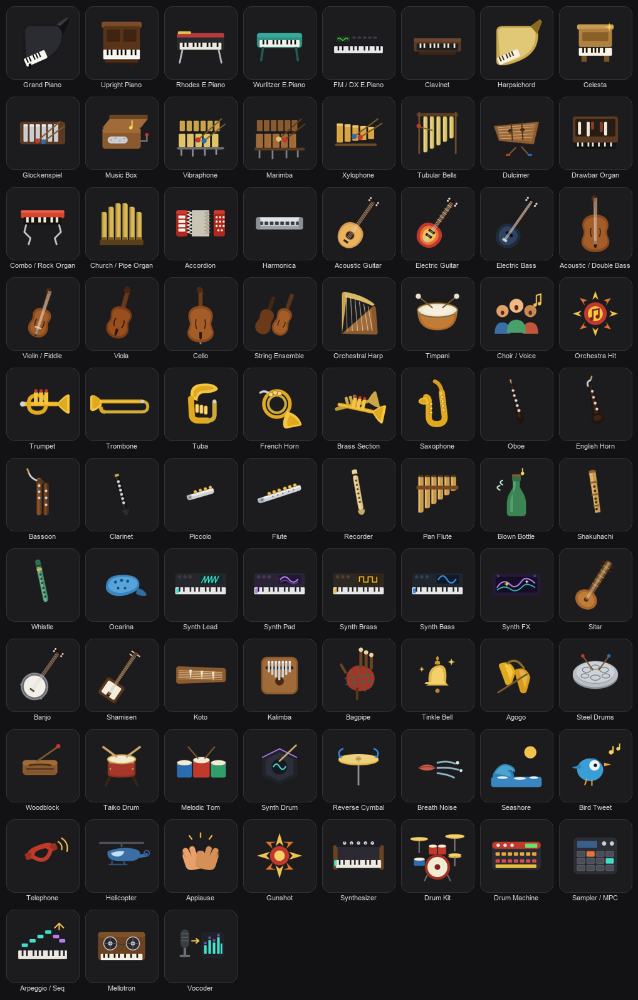

# Music Instruments for Stage Keys

> A Stream Deck icon pack for the live keyboardist (short name: **Stage Keys**).

**Full-colour sound-select icons for the live keyboardist.** One Stream Deck
key per voice, covering the complete **General MIDI / XP** sound set (all 128
programs, 16 families) **plus the modern synth categories** best-selling synths
expose that GM has no program for. Recognise the sound at a glance under stage
lighting — no menu-diving, no patch numbers.



## Why a keyboardist needs this

A keyboard player rarely holds a single sound through a whole song. The verse
is on a **Rhodes**, the chorus opens up on a **synth pad**, the bridge moves to
**strings**, the solo jumps to **organ**, the intro was **acoustic piano**. In
the studio there's time; **live, the change has to land exactly on the beat,
without looking away from the keys**.

This pack turns a Stream Deck into a dedicated **sound selector** beside the
keyboard:

- **One physical key = one voice.** No scrolling through programs, no aiming at
  a tiny screen mid-phrase.
- **Read the sound by shape + colour, not text.** Under low light and stress you
  recognise an object (an organ, a sax, the red Rhodes rail) far faster than an
  abstract colour code or a patch name — which is why these are full-colour
  illustrations, not monochrome silhouettes.
- **See the sound before you press it.** No landing on the wrong program at the
  wrong moment.

## Make the keys actually switch sounds

These icons are the *visual* layer. To make pressing a key **change your synth's
sound**, pair them with a Stream Deck plugin that sends a **MIDI Program Change**
(and optional Bank Select) to your keyboard or workstation. Two good options:

- **[Midi Button](https://marketplace.elgato.com/product/midi-button-c05a29fa-8080-4deb-96ac-8d8564dcdaa6)
  by Tom Kelly** — **free** and open-source
  ([GitHub](https://github.com/tsbkelly/Streamdeck-Midibutton)); sends Program
  Change, CC, Notes and MMC. The easy free way to fire one Program Change per key.
- **[MIDI by Trevligaspel](https://marketplace.elgato.com/product/midi-b068a591-1a69-48fe-9206-b2d24762228b)**
  (`se.trevligaspel.midi`) — **paid**, more advanced: Program Change + Bank
  Select, CC, NRPN, Notes, Pitch Bend, SysEx, MMC/MSC, Mackie Control, dials and
  Stream Deck+. A **Push Button** fires one Program Change; a **Cycle Button**
  steps through a list of patches.
  Docs: [Program Change](https://trevligaspel.se/streamdeck/midi/index.php/buttons/generic/program-change).

Workflow: set a key's action to the Program Change (+ Bank Select MSB/LSB) of a
patch on your synth, then set its **icon from this pack** — using the
[GM-MAP](GM-MAP.md) to line each program number up with its icon. Now the Rhodes
key *is* your Rhodes patch, the organ key *is* your organ: one press, right on
the beat, no menu-diving. *(Both plugins are third-party and not affiliated with
this pack.)*

## What's inside (83 icons)

Organised around the **General MIDI (GM 1) sound map** — the same 16 banks a
Roland XP / SC / GS and any GM workstation expose — so it doubles as an XP patch
→ icon guide. 76 icons give every one of the 128 GM programs a dedicated icon
(only same-instrument variations reuse a drawing), plus **7 modern synth
categories**. Full program-by-program table: **[GM-MAP.md](GM-MAP.md)**.

- **Piano** — grand, upright, Rhodes, Wurlitzer, FM/DX, clavinet, harpsichord
- **Chromatic percussion** — celesta, glockenspiel, music box, vibraphone,
  marimba, xylophone, tubular bells, dulcimer
- **Organ** — drawbar, combo/rock, church/pipe, accordion, harmonica
- **Guitar / bass** — acoustic & electric guitar, electric & double bass
- **Strings** — violin, viola, cello, ensemble, harp, timpani
- **Ensemble** — choir/voice, orchestra hit
- **Brass** — trumpet, trombone, tuba, french horn, brass section
- **Reed / pipe** — saxophone, oboe, english horn, bassoon, clarinet, piccolo,
  flute, recorder, pan flute, blown bottle, shakuhachi, whistle, ocarina
- **Synth** — lead, pad, brass, bass, FX
- **Ethnic / percussive** — sitar, banjo, shamisen, koto, kalimba, bagpipe,
  tinkle bell, agogo, steel drums, woodblock, taiko, melodic tom, synth drum,
  reverse cymbal
- **Sound effects** — breath, seashore, bird tweet, telephone, helicopter,
  applause, gunshot
- **Beyond GM (modern synth categories)** — synthesizer, drum kit, drum
  machine, sampler/MPC, arpeggio/seq, mellotron, vocoder

## Install

Download **[`dist/com.beennnn.stagekeys.streamDeckIconPack`](dist/)** and
double-click it — the pack installs into Stream Deck's Icon Library, with
per-icon names and searchable tags.

## Rebuild from source

Icons are authored as parametric SVGs in [`src/`](src/) and rendered to
144 × 144 PNG. Built with **[sdicons](https://github.com/Beennnn/stream-deck-icons)**
(the generic Stream Deck icon-pack toolkit):

```sh
# with the sdicons toolkit cloned alongside this repo:
bin/build.sh
# → regenerates icons/, icons.json and a submit-ready
#   dist/com.beennnn.stagekeys.streamDeckIconPack
```

Names and tags come from [`tags.json`](tags.json); pack metadata is in
[`manifest.json`](manifest.json).

## Publishing to the Elgato Marketplace

`bin/build.sh` produces a **submit-ready** `.streamDeckIconPack` (the correct
`com.beennnn.stagekeys.sdIconPack/` container) — double-click to install, or
upload straight to the **[Maker Console](https://maker.elgato.com/)** after
review. Elgato's [Icon Pack Man](https://iconpackman.elgato.com/) web tool is
*optional* (and drops icon names/tags on import — `sdicons repair` fixes its
exports). The Marketplace listing media (thumbnail, icon previews, gallery) is
generated at the console's exact dimensions by `bin/maker-media.sh`
(→ `maker-media/`, gitignored). Full process: [sdicons publishing docs](https://github.com/Beennnn/stream-deck-icons/blob/main/docs/publishing.md).

## License

Icons: **CC-BY-4.0** (see [LICENSE](LICENSE)) — free to use with attribution.
